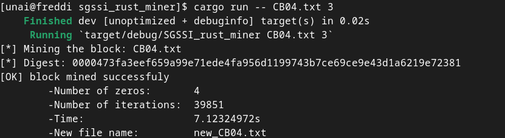

# SGSSI RUST MINER

<<<<<<< HEAD
Este proyecto es una versión en Rust de [SGSSI_minero](https://github.com/UnaiFernandez/SGSSI_minero). El objetivo del minero en es conseguir que el resumen del último bloque tenga la mayor cantidad de ceros al principio del resumen sha256 del bloque. Mediante este programa, se calcula el resumen con la cantidad de ceros establecida en el segundo parametro como minimo.
=======
En la asignatura SGSSI el resumen criptográfico de cada trabajo que se entrega se almacena en un bloque. Cada bloque guarda los resúmenes sha256 de cada trabajo de cada alumno correspondientes a esa actividad. La estructura de un bloque es la siguiente:

* Número de bloque
* Título de la tarea + número de elementos
* identificador del bloque anterior
* Resúmenes sha256

El objetivo del minero en es conseguir que el resumen del último bloque tenga la mayor cantidad de ceros al principio del resumen sha256 del bloque. Mediante este programa, se calcula el resumen con la cantidad de ceros establecida en el segundo parametro.
>>>>>>> b8cb9de (README.md added)
## Instrucciones de uso

### Instalando lo necesario

Instalar la herramienta rustup, para gestionar las versiones de Rust y otras herramientas asociadas.

    curl --proto '=https' --tlsv1.2 -sSf https://sh.rustup.rs | sh

(Para instalar la ultima version: [Install Rust](https://www.rust-lang.org/tools/install))

Para la creación de aplicaciones y su ejecución se usara el gestor de paquetes de Rust *Cargo*. Cargo viene preintalado si al instalar se han usado los instaladores oficiales. 

**Para compilar el programa usa:**

    cargo build

**Para ejecutarlo usa:**

    cargo run -- CBXX N

El primer parametro es el nombre del bloque (CB04 en este caso, porque es el unico disponible en el repositorio) y el segundo parametro es el numero de ceros que se quieren obteber como minimo al principio del resumen.

**Para hacer clean ejecuta:**

    cargo clean

De esta manera se eliminan todos los archivos no necesarios, generados al compilar el código.

## Integridad de los archivos
<<<<<<< HEAD

**Cargo.toml:** 90a99203b1edd2eb1a2fe5795e9d1d7691ad448601f4f9d7a125b1199a53a3f7

**main.rs:** 04360f977832fe32cce9b990a27c0c0a775af60afa0ca8ff04271a299197ea16
=======
>>>>>>> b8cb9de (README.md added)
